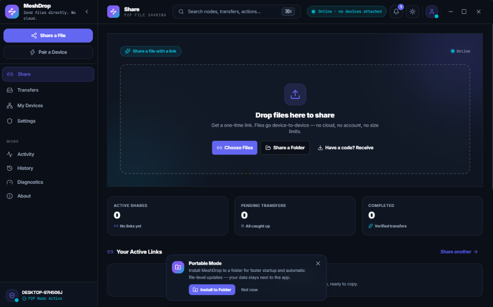
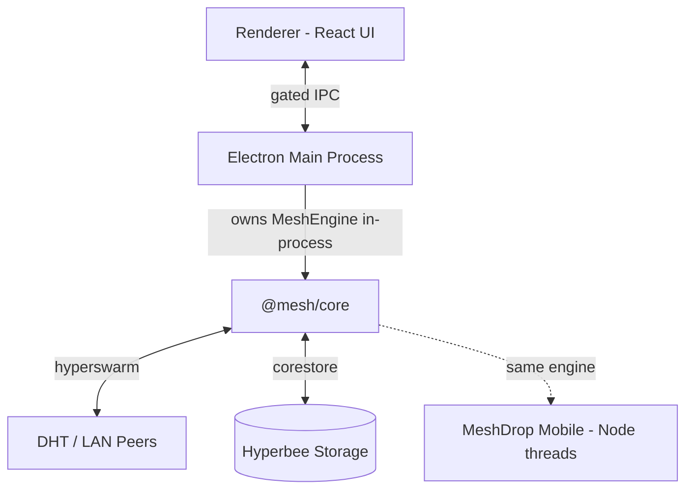

# MeshDrop

**Zero-cloud P2P file sharing.** Direct, end-to-end encrypted file transfers between your own devices. No accounts, no cloud, no size limits.



---

## 🌟 Features

- **Zero-Cloud & E2EE** — Direct peer-to-peer file transfers encrypted with Noise protocol (`Noise_XX_25519_ChaChaPoly_BLAKE2b`). No third-party server ever touches your files or metadata.
- **Code-Based & QR Pairing** — Connect devices using short `MD-` pairing codes or QR scans. Trust is verified via HMAC-SHA256 challenge-response without transmitting raw codes.
- **One-Time Anonymous Drops** — Send files instantly using single-use `DROP-` codes without pairing devices beforehand.
- **LAN & Internet Routing** — Automatic local network peer discovery via mDNS/LAN broadcast, with seamless public DHT fallback and TCP relay tunnelling for restrictive NATs.
- **Resumable Chunked Transfers** — Chunk-scheduled transfers with per-block and whole-file SHA-256 verification. Interrupted transfers resume automatically from the last verified block.
- **Portable Mode with Custom Install** — Run as a single-file portable executable (`MeshDrop-1.0.0-portable.exe`) with an interactive **Install to Folder** option:
  - Custom target directory picker
  - Desktop shortcut creation
  - Start Menu integration
  - Windows Auto-Start option
- **System Tray & Window Management** — Runs smoothly in the background system tray. Double-clicking desktop icons or tray notifications restores and focuses the app instantly.
- **Incoming Approval Gate** — Optional manual acceptance holds incoming file requests until explicitly accepted.

---

## 📐 Architecture & Core Engine

MeshDrop is designed around a clean **Open Core** architecture:



- **`@mesh/core` (`core/`)** — The standalone, platform-agnostic P2P networking and transfer engine. Zero Electron or DOM dependencies. Runs in-process on Desktop, and is being ported to run on device Node threads for the upcoming Android app.
- **Desktop Application (`electron/`, `renderer/`)** — Glassmorphic React UI built with TypeScript, Vite, and Tailwind CSS, connected to main process IPC bridges (`contextIsolation` enabled).

---

## 💻 Supported Platforms

| Platform | Distribution Format | Status |
| :--- | :--- | :--- |
| **Windows** | NSIS Installer (`.exe`), Single-File Portable (`.exe`) | ✅ v1.0.0-beta.2 |
| **macOS** | DMG Package (`.dmg`, arm64) | ✅ v1.0.0-beta.2 |
| **Linux** | AppImage (`.AppImage`, x86_64) | ✅ v1.0.0-beta.2 |
| **Android** | React Native (Android) | 🚧 In Development |

---

## 🛠️ Development Setup

Prerequisites: Node.js 20+.

```bash
# Clone the repository
git clone https://github.com/aamirali51/MeshDesk.git
cd MeshDesk

# Install dependencies
npm install

# Start local development server (Vite + Electron)
npm run dev

# Run side-by-side local P2P instances for testing
npm run dev:p2p

# Run end-to-end engine test suite (41/41 checks)
npm test
```

---

## 📦 Packaging & Building

Pre-built installers for Windows, macOS, and Linux are published to
[GitHub Releases](https://github.com/aamirali51/MeshDesk/releases).

```bash
# Package production build locally (NSIS + DMG + AppImage in dist/)
npm run build:pack

# Package & upload to GitHub Releases
npm run build:release
```

Generated build outputs in `dist/`:
- `MeshDrop-Setup-<version>.exe` (Windows — NSIS Assisted Per-User Installer)
- `MeshDrop-<version>-portable.exe` (Windows — Single-File Portable)
- `MeshDrop-<version>-mac-arm64.dmg` (macOS — Apple Silicon)
- `MeshDrop-<version>-linux-x86_64.AppImage` (Linux)

---

## 🤝 Contributing

MeshDrop is open source — bug reports, documentation, UI polish, and engine
improvements are all welcome. See [CONTRIBUTING.md](CONTRIBUTING.md) for the
dev setup, contribution workflow, and our DCO sign-off requirement.

---

## ⚖️ License & Trademark

MeshDrop is **open source** under the **[MIT License](LICENSE)** (SPDX: `MIT`). The entire
repository — the `@mesh/core` engine, the desktop application (`renderer/`, `electron/`), and
packaging code — is free to use, modify, and distribute, including commercially.

The **"MeshDrop" name, logo, and icons are protected trademarks** of the copyright holder and
are governed by the [Trademark Policy](TRADEMARK_POLICY.md) — a separate document from the MIT
License. You may fork and reuse all of the code freely, but you may not ship derivative products
under the MeshDrop name or brand without written permission.

---

## 📄 License

- Code: [MIT](LICENSE)
- Brand: [Trademark Policy](TRADEMARK_POLICY.md)

Copyright (c) 2026 aamirali51.
