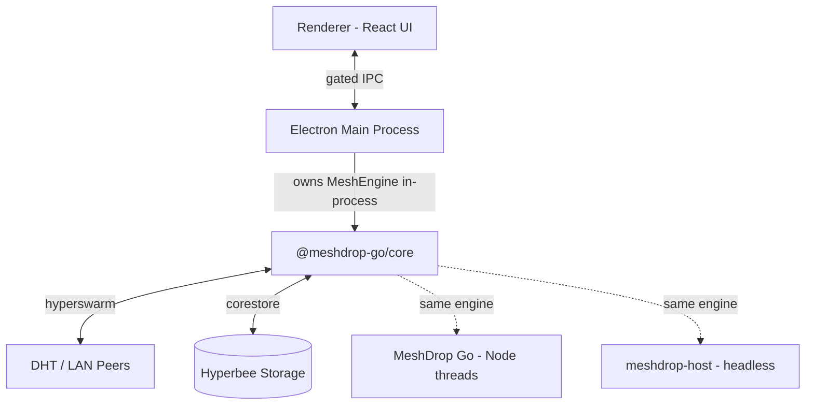

# MeshDrop Go

**Zero-cloud P2P file sharing.** Direct, end-to-end encrypted file transfers between your own devices. No accounts, no cloud, no size limits.

---

## Ecosystem

This repository contains the desktop (Electron) and mobile (React Native) clients. The P2P engine and the headless host live in separate public repos so they can be reused independently.

| Repository                                                           | Visibility | Contents                                          |
| -------------------------------------------------------------------- | ---------- | ------------------------------------------------- |
| **meshdrop-app** (this repo)                                         | Public     | Desktop + mobile clients                          |
| [meshdrop-core](https://github.com/aamirali51/meshdrop-core)         | Public     | P2P engine — `@meshdrop-go/core`                  |
| [meshdrop-host](https://github.com/aamirali51/meshdrop-host)         | Public     | Headless host + `mesh` CLI — `@meshdrop-go/host`  |
| [meshdrop-releases](https://github.com/aamirali51/meshdrop-releases) | Public     | Release artifacts for the auto-updater            |

---

## Features

- **Zero-Cloud & E2EE** — Direct peer-to-peer file transfers encrypted with Noise protocol (`Noise_XX_25519_ChaChaPoly_BLAKE2b`). No third-party server ever touches your files or metadata.
- **Code-Based & QR Pairing** — Connect devices using short `MD-` pairing codes or QR scans. Trust is verified via HMAC-SHA256 challenge-response without transmitting raw codes.
- **One-Time Anonymous Drops** — Send files instantly using single-use `DROP-` codes without pairing devices beforehand.
- **Never-Expiring Links** — Create a Drop Code with the **Never** expiry for a genuinely permanent share link (no countdown). Max-download limits (or unlimited) still apply.
- **Command-Line & Headless Host** — Run MeshDrop with **no GUI** on a server or NAS via [`@meshdrop-go/host`](https://github.com/aamirali51/meshdrop-host): a 47-command `mesh` CLI, `mesh service install`, a config file, logs, and a Docker image. See below.
- **In-App Guide** — A built-in Guide (nav → **Guide**) walks through every feature step by step, including per-platform CLI install.
- **LAN & Internet Routing** — Automatic local network peer discovery via mDNS/LAN broadcast, with seamless public DHT fallback and TCP relay tunnelling for restrictive NATs.
- **Resumable Chunked Transfers** — Chunk-scheduled transfers with per-block and whole-file SHA-256 verification. Interrupted transfers resume automatically from the last verified block.
- **Portable Mode with Custom Install** — Run as a single-file portable executable (`MeshDrop-<version>-portable.exe`) with an interactive **Install to Folder** option:
  - Custom target directory picker
  - Desktop shortcut creation
  - Start Menu integration
  - Windows Auto-Start option
- **System Tray & Window Management** — Runs smoothly in the background system tray. Double-clicking desktop icons or tray notifications restores and focuses the app instantly.
- **Incoming Approval Gate** — Optional manual acceptance holds incoming file requests until explicitly accepted.

---

## Command line & NAS / servers

The GUI is optional — `meshdrop-host` runs the exact same engine headless and exposes the app protocol over a token-authed localhost API.

```sh
npm install -g @meshdrop-go/host
mesh service install          # start on boot (systemd / launchd / Windows task)
mesh status --watch           # live peers, connection, transfers
mesh drop ./folder --never    # permanent share link
mesh watch ~/inbox --to nas   # auto-send new files
```

Or on a NAS / server with Docker (host networking **required**):

```sh
docker run -d --name meshdrop --network host \
  -e PUID=1000 -e PGID=1000 -e MESHDROP_HOST_NAME=nas \
  -v ./meshdrop-data:/data -v ./meshdrop-downloads:/downloads \
  --restart unless-stopped ghcr.io/aamirali51/meshdrop-host:latest
```

Full docs: [meshdrop-host](https://github.com/aamirali51/meshdrop-host) · [USER-GUIDE.md](USER-GUIDE.md).

---

## Architecture


```mermaid
graph TD
    R["Renderer - React UI"] <-->|gated IPC| M["Electron Main Process"]
    M -->|owns MeshEngine in-process| C["@meshdrop-go/core"]
    C <-->|hyperswarm| N["DHT / LAN Peers"]
    C <-->|corestore| S[("Hyperbee Storage")]
    C -.->|same engine| RN["MeshDrop Go - Node threads"]
    C -.->|same engine| H["meshdrop-host - headless"]
```

- **`@meshdrop-go/core`** ([meshdrop-core](https://github.com/aamirali51/meshdrop-core)) — The standalone, platform-agnostic P2P networking and transfer engine. Zero Electron or DOM dependencies. Runs in-process on Desktop, via Node threads on mobile, and headless in `meshdrop-host`.
- **Desktop Application (`electron/`, `renderer/`)** — Glassmorphic React UI built with TypeScript, Vite, and Tailwind CSS, connected to main process IPC bridges (`contextIsolation` enabled).

---

## Supported Platforms

| Platform    | Distribution Format                                    | Status      |
| :---------- | :----------------------------------------------------- | :---------- |
| **Windows** | NSIS Installer (`.exe`), Single-File Portable (`.exe`) | ✅ v1.0.69  |
| **macOS**   | DMG / ZIP (`.dmg`, arm64 + x64)                        | ✅ v1.0.69  |
| **Linux**   | AppImage (`.AppImage`, x86_64)                         | ✅ v1.0.69  |
| **Android** | React Native APK (`.apk`)                              | ✅ v1.0.69  |

Pre-built downloads: [GitHub Releases](https://github.com/aamirali51/meshdrop-releases/releases)

---

## Development Setup

Prerequisites: Node.js 20+.

Clone both repos as siblings:

```bash
git clone https://github.com/aamirali51/meshdrop-app.git
git clone https://github.com/aamirali51/meshdrop-core.git
cd meshdrop-app
npm install
```

```bash
# Start local development server (Vite + Electron)
npm run dev

# Run side-by-side local P2P instances for testing
npm run dev:p2p

# Run end-to-end engine test suite
npm test
```

The relative paths `../../meshdrop-core` in `electron/engine.js`, `electron/handlers.js`, and `file:../../meshdrop-core` in `meshdrop-mobile-rn81/package.json` resolve from this sibling layout.

---

## Packaging & Building

```bash
# Package production build locally (NSIS + DMG + AppImage in dist/)
npm run build:pack

# Package & upload to GitHub Releases (requires GH_TOKEN)
npm run build:release
```

Generated build outputs in `dist/`:

- `MeshDrop-Setup-<version>.exe` (Windows — NSIS installer)
- `MeshDrop-<version>-portable.exe` (Windows — single-file portable)
- `MeshDrop-<version>-mac-arm64.dmg` (macOS — Apple Silicon)
- `MeshDrop-<version>-linux-x86_64.AppImage` (Linux)

All artifacts are published to [meshdrop-releases](https://github.com/aamirali51/meshdrop-releases/releases).

---

## CI/CD

The GitHub Actions workflow (`.github/workflows/release.yml`) triggers on `v*` tags and:

1. Builds desktop apps for Windows, macOS, and Linux in parallel
2. Publishes artifacts to the `meshdrop-releases` GitHub Release
3. Signs portable builds with `MESHDROP_UPDATE_KEY` (if configured)
4. Builds the Android APK and attaches it to the same release

Required secrets in this repo:

| Secret                | Purpose                                                                            |
| --------------------- | ---------------------------------------------------------------------------------- |
| `RELEASES_PAT`        | Classic PAT with `repo` scope — uploads artifacts to `meshdrop-releases`           |
| `MESHDROP_UPDATE_KEY` | Ed25519 private key — signs portable APK/exe for integrity verification (optional) |

The CLI/headless host has its own workflow in `meshdrop-host` (tag `cli-v*` → npm + GHCR), independent of app releases.

---

## Contributing

MeshDrop Go is open source — bug reports, documentation, UI polish, and engine
improvements are all welcome. See [CONTRIBUTING.md](CONTRIBUTING.md) for the
dev setup, contribution workflow, and our DCO sign-off requirement.

---

## License & Trademark

MeshDrop Go is **open source** under the **[MIT License](LICENSE)** (SPDX: `MIT`). The entire
codebase — the `@meshdrop-go/core` engine, the desktop application, and packaging code —
is free to use, modify, and distribute, including commercially.

The **"MeshDrop Go" name, logo, and icons are protected trademarks** of the copyright holder and
are governed by the [Trademark Policy](TRADEMARK_POLICY.md) — a separate document from the MIT
License. You may fork and reuse all of the code freely, but you may not ship derivative products
under the MeshDrop Go name or brand without written permission.
